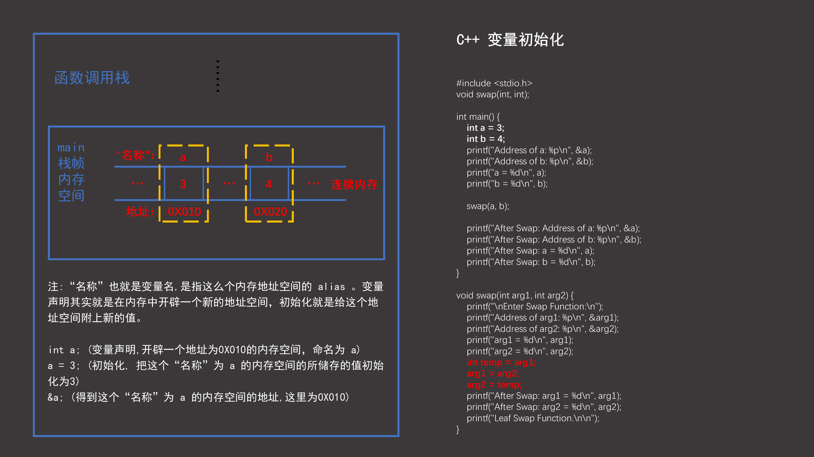
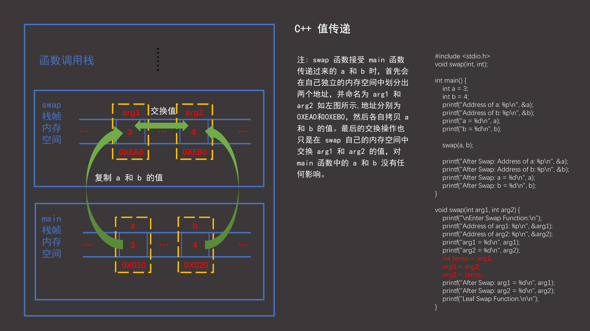
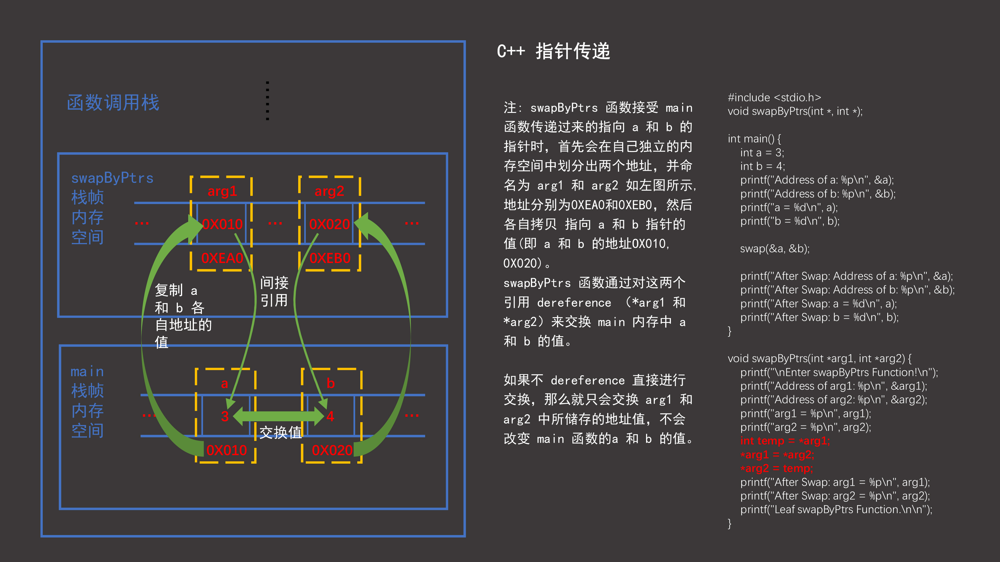
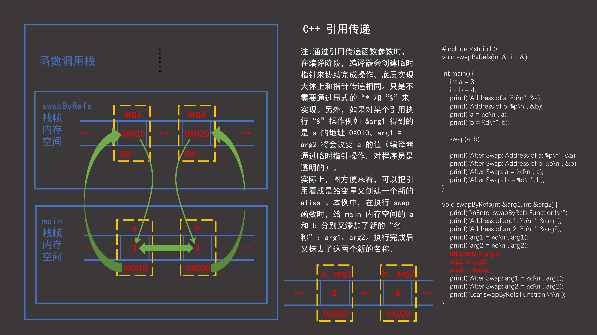

[TOC]

# C++ 中函数参数传递方式

作者对 `C` 有一些了解，对 *C++* 了解很少，今天看 *CSAPP* （*COMPUTER SCIENCE: A PROGRAMMER'S PESPECTIVE*） 时候查资料了解到 *C++* 中有“三”种传递参数的方式：By Value、By Pointer、By Reference（值传递、指针传递、引用传递）。这种说法个人认为是不严谨的，严格来说在这里**指针传递也应该归为值传递的一种** (在 *THE C PROGRAMMING LANGUAGE* 一书中，小节*1.8 Arguments - Call by Value* 给出了解释，下面的案例中也会证明这一点)，所以 *C++* 中实际只有两种传参方式：

- **值传递**
- **引用传递**

## 值传递

### 非指针传递

``` c
#include <stdio.h>
void swap(int, int);

int main() {
    int a = 3;
    int b = 4;
  	printf("Address of a: %p\n", &a);
    printf("Address of b: %p\n", &b);
    printf("a = %d\n", a);
    printf("b = %d\n", b);
    
    swap(a, b);
    
    printf("After Swap: Address of a: %p\n", &a);
    printf("After Swap: Address of b: %p\n", &b);
    printf("After Swap: a = %d\n", a);
    printf("After Swap: b = %d\n", b);
}

void swap(int arg1, int arg2) {
    printf("\nEnter Swap Function:\n");
    printf("Address of arg1: %p\n", &arg1);
    printf("Address of arg2: %p\n", &arg2);
    printf("arg1 = %d\n", arg1);
    printf("arg2 = %d\n", arg2);
    int temp = arg1;
    arg1 = arg2;
    arg2 = temp;
    printf("After Swap: arg1 = %d\n", arg1);
    printf("After Swap: arg2 = %d\n", arg2);
    printf("Leaf Swap Function.\n\n");
}

// 结果：
//Address of a: 0061FF1C
//Address of b: 0061FF18
//a = 3
//b = 4

//Enter Swap Function:
//Address of arg1: 0061FF00
//Address of arg2: 0061FF04
//arg1 = 3
//arg2 = 4
//After Swap: arg1 = 4
//After Swap: arg2 = 3
//Leaf Swap Function.

//After Swap: Address of a: 0061FF1C
//After Swap: Address of b: 0061FF18
//After Swap: a = 3
//After Swap: b = 4
```

该例中函数 *swap* 中的一系列操作并没有改变 *main* 函数中的 *a* 和 *b* 的值。当执行 *swap* 函数时候，创建一个新的函数栈帧，在里面划分了两个新的内存地址用来复制储存 *main* 函数栈帧的 *a* 和 *b* 的值，并分别命名为 局部变量*arg1* 和 *arg2*，函数内部的交换操作也只是针对函数内部的这两个局部变量 （也可以理解为交换 *swap* 栈内存中的这两个新的内存地址所储存的值），这一切对主函数 *main* 的变量无任何影响。下面两图给了该例中的内存的示意模型（简化版，实际情况要复杂得多）：





### 指针传递

```c
#include <stdio.h>
void swapByPtrs(int *, int *);

int main() {
    int a = 3;
    int b = 4;
    printf("Address of a: %p\n", &a);
    printf("Address of b: %p\n", &b);
    printf("a = %d\n", a);
    printf("b = %d\n", b);
    
    swap(a, b);
    
    printf("After Swap: Address of a: %p\n", &a);
    printf("After Swap: Address of b: %p\n", &b);
    printf("After Swap: a = %d\n", a);
    printf("After Swap: b = %d\n", b);
}

void swapByPtrs(int *arg1, int *arg2) {
    printf("\nEnter swapByPtrs Function!\n");
    printf("Address of arg1: %p\n", &arg1);
    printf("Address of arg2: %p\n", &arg2);
    printf("arg1 = %p\n", arg1);
    printf("arg2 = %p\n", arg2);
    int temp = *arg1;
    *arg1 = *arg2;
    *arg2 = temp;
    printf("After Swap: arg1 = %p\n", arg1);
    printf("After Swap: arg2 = %p\n", arg2);
    printf("Leaf swapByPtrs Function.\n\n");
}


//结果:
//Address of a: 0061FF1C
//Address of b: 0061FF18
// a = 3
// b = 4

// Enter swapByPtrs Function!
// Address of arg1: 0061FF00
// Address of arg2: 0061FF04
// arg1 = 0061FF1C
// arg2 = 0061FF18
// After Swap: arg1 = 0061FF1C
// After Swap: arg2 = 0061FF18
// Leaf swapByPtrs Function.

// After Swap: Address of a: 0061FF1C
// After Swap: Address of b: 0061FF18
// After Swap: a = 4
// After Swap: b = 3
```



## 引用传递

```C
#include <stdio.h>
void swapByRefs(int &, int &);

int main() {
    int a = 3;
    int b = 4;
    printf("Address of a: %p\n", &a);
    printf("Address of b: %p\n", &b);
    printf("a = %d\n", a);
    printf("b = %d\n", b);
    
    swap(a, b);
    
    printf("After Swap: Address of a: %p\n", &a);
    printf("After Swap: Address of b: %p\n", &b);
    printf("After Swap: a = %d\n", a);
    printf("After Swap: b = %d\n", b);
}

void swapByRefs(int &arg1, int &arg2) {
    printf("\nEnter swapByRefs Function!\n");
    printf("Address of arg1: %p\n", &arg1);
    printf("Address of arg2: %p\n", &arg2);
    printf("arg1 = %d\n", arg1);
    printf("arg2 = %d\n", arg2);
    int temp = arg1;
    arg1 = arg2;
    arg2 = temp;
    printf("After Swap: arg1 = %d\n", arg1);
    printf("After Swap: arg2 = %d\n", arg2);
    printf("Leaf swapByRefs Function.\n\n");
}

```



