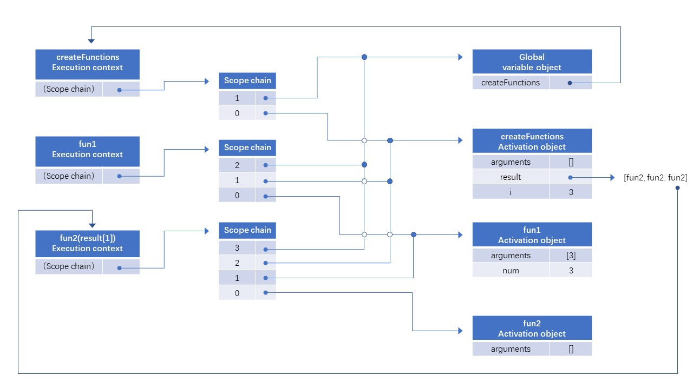

[TOC]

# 函数表达式

##  function declaration & function expression

More info:

1.  [Function Expression & Function Declaration & Named Function Expression.md](../Function Expression & Function Declaration & Named Function Expression.md)
2. [Hoisting and JavaScript Variable Scope.md](../Hoisting and JavaScript Variable Scope.md)
3.  [Named Function Expression.md](../Named Function Expression.md)

## 闭包Closure

closure: 有权访问另一个函数作用域中的变量的函数。创建闭包的常见方式，就是在一个函数内部创建另一个函数。

```js
function createComparisonFunction(propertyName) {
    return function(object1, object2) {
        var value1 = object1[propertyName];
        var value2 = object2[propertyName];
        
        return value1 - value2
    }
}
```


<u>当某个函数被调用时，会创建一个**执行环境  (execution context)**， 以及相应的**作用域链**。然后，使用 **arguments** 和其他命名参数的值来初始化函数的**活动对象 (activation object)**。但在作用链中，外部函数的活动对象始终处于第二位，外部函数的外部函数的活动对象处于第三位，……直至作为作用域链终点的全局执行环境。</u>

*When a function is called, an execution context is created, and its scope chain is created. The activation object for the function is initialized with values for arguments and any named arguments. The outer function’s activation object is the second object in the scope chain. This process continues for all containing functions until the scope chain terminates with the global execution context.*

**A function that is defined inside another function adds the containing function's activation object into its scope chain.**

## Closures and Variables

The closure always gets the last value of any variable from the containing function.

```js
function createFunctions() {
    var result = new Array();
    
    for (var i=0; i < 10; i++) {
        result[i] = function () {
            return i;
        };
    }
    
    return result;
}
```


Since each function has the createFunctions() activation object in its scope chain, they are all referring to the same variable, i. When createFunctions() finishes running, the value of i is 10, and since every function references the same variable object in which i exists, the value of i inside each function is 10.


A fix:

```js
function createFunctions() {
    var result = new Array();
    
    for (var i=1; i <= 10; i++) {
        result[i] = function fun1(num) {
            return function fun2() {
                return num;
            };
        }(i);
    }
    
    return result;
}
```


此时for循环进行第一次时候，如下图所示:


for 循环进行第三次时候，如下图所示:




